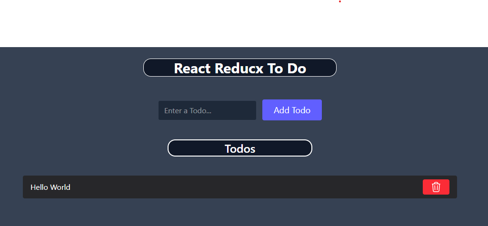

# Redux Toolkit Todo Slice

A minimal implementation of a Todo feature using Redux Toolkit.

## Features

- Add and remove todos
- Unique IDs for each todo using `nanoid`
- Built with `createSlice` from Redux Toolkit

## Setup

1. Install required dependencies: `@reduxjs/toolkit` and `react-redux`
2. Define a todo slice with reducers for adding and removing todos
3. Configure the Redux store and connect it to your React app
4. Use `useSelector` and `useDispatch` to access and update the todo state in components

## screenshot

